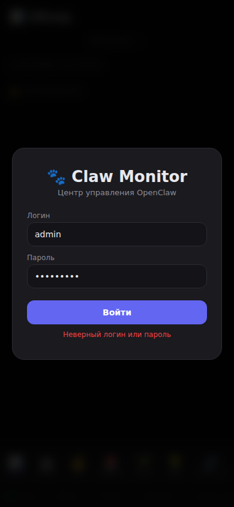
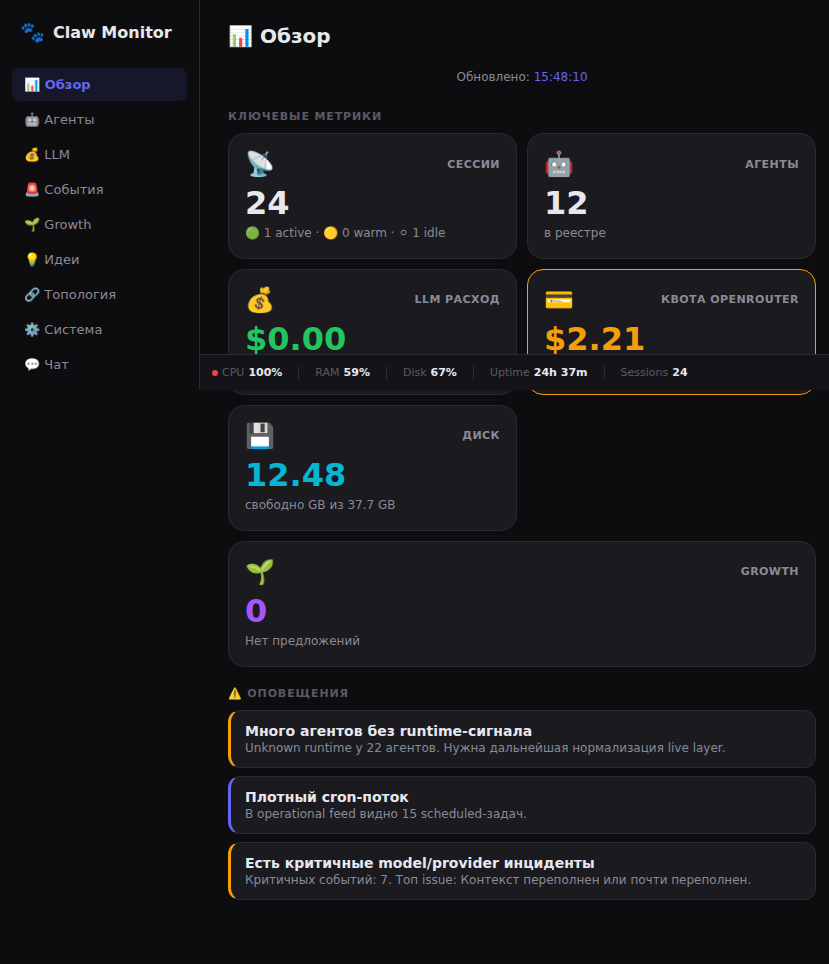
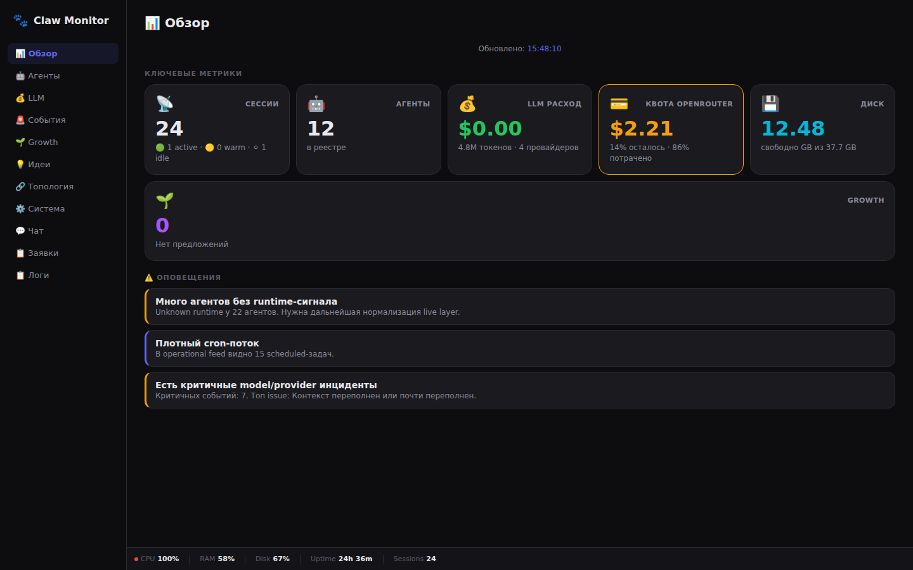

# Claw Monitor 🎛️

Lightweight monitoring dashboard for OpenClaw agents, LLM usage, and system health.

**Mobile-first design** with responsive layouts for both phone and desktop.


## Features

- 📊 **Overview** — Key metrics at a glance: sessions, agents, LLM costs, disk usage, alerts
- 🤖 **Agents** — Visual tree of your agent hierarchy with real-time status (active/warm/idle)
- 💰 **LLM Usage** — Track token consumption, costs, and hot sessions per provider
- 🚨 **Incidents** — Monitor errors and warnings from your LLM providers
- 🌱 **Growth** — Track improvement proposals and best next actions
- 🔗 **Topology** — Agent architecture visualization (customizable)
- ⚙️ **System** — Server health: CPU, memory, disk, task queue
- 💬 **Chat** — Command interface for quick actions
- 📋 **Logs** — Real-time log tailing for gateway and backend

## Screenshots

| Mobile (Portrait) | Mobile (Landscape) | Desktop |
|---|---|---|
|  |  |  |

## Architecture

```
┌─────────────────────────────────────────────────┐
│                 Caddy (HTTPS)                   │
├────────────────────┬────────────────────────────┤
│   Frontend :3000   │    Backend API :8000       │
│   (Static files)   │    (FastAPI + uvicorn)     │
└────────────────────┴────────────────────────────┘
                        │
                        ▼
              OpenClaw Gateway (18789)
              OpenClaw CLI (sessions, status)
```

## Quick Start

### Prerequisites

- Python 3.10+
- Node.js 18+ (optional, for dev server)
- OpenClaw instance running locally

### Installation

```bash
# Clone the repo
git clone https://github.com/YOUR_USERNAME/claw-monitor.git
cd claw-monitor

# Setup backend
cd backend
python3 -m venv .venv
source .venv/bin/activate
pip install -r requirements.txt

# Configure auth
cp config/auth.json.example config/auth.json
# Edit config/auth.json with your credentials

# Start services
# Terminal 1: Backend
cd backend && source .venv/bin/activate && uvicorn app.main:app --host 127.0.0.1 --port 8000

# Terminal 2: Frontend
cd frontend && python3 -m http.server 3000 --bind 127.0.0.1
```

### Production Setup (with Caddy)

```caddyfile
# /etc/caddy/Caddyfile
your-domain.com {
    reverse_proxy /api/* 127.0.0.1:8000
    root * /path/to/claw-monitor/frontend
    file_server
}
```

## Configuration

### Auth

Edit `config/auth.json`:

```json
{
  "username": "admin",
  "password_hash": "sha256_hash_of_your_password"
}
```

Generate password hash:
```bash
python3 -c "import hashlib; print(hashlib.sha256(b'yourpassword').hexdigest())"
```

### Environment Variables

| Variable | Default | Description |
|----------|---------|-------------|
| `OPENCLAW_HOME` | `~/.openclaw` | OpenClaw config directory |
| `LLM_DECK_PORT` | `8000` | Backend API port |
| `LLM_DECK_LOG_TAIL_LINES` | `100` | Default log tail lines |

## API Endpoints

| Endpoint | Description |
|----------|-------------|
| `GET /api/auth/status` | Check auth status |
| `POST /api/auth/login` | Login |
| `GET /api/details/snapshot` | Full dashboard snapshot |
| `GET /api/registry/agents` | List registered agents |
| `GET /api/registry/topology` | Agent topology |
| `GET /api/llm/summary` | LLM usage summary |
| `GET /api/llm/providers` | Usage by provider |
| `GET /api/incidents/events` | Recent incidents |
| `GET /api/system/status` | System health |
| `GET /api/logs/tail/{source}` | Tail logs |

## Customization

### Adding New Pages

1. Add page HTML to `frontend/index.html`
2. Add loader function to `frontend/app.js`
3. Add route to sidebar and bottom nav
4. Add API endpoint in backend if needed

### Styling

All styles are in `frontend/styles.css`. Key CSS variables:

```css
:root {
  --bg: #0f172a;          /* Background */
  --surface: #111827;     /* Card background */
  --accent: #3b82f6;      /* Primary accent */
  --green: #22c55e;       /* Success/active */
  --orange: #f59e0b;      /* Warning */
  --red: #ef4444;         /* Error/critical */
}
```

## Development

```bash
# Install dev dependencies
cd backend && pip install -r requirements-dev.txt

# Run with auto-reload
uvicorn app.main:app --reload --host 127.0.0.1 --port 8000

# Frontend is static files, just refresh browser
```

## Roadmap

- [ ] Topology visualization with actual connection lines
- [ ] Session detail drill-down
- [ ] Export metrics to CSV
- [ ] Dark/Light theme toggle
- [ ] Multi-instance support
- [ ] WebSocket real-time updates (replace polling)

## License

MIT License — see [LICENSE](LICENSE) for details.

## Credits

Built with [FastAPI](https://fastapi.tiangolo.com/), vanilla JavaScript (no frameworks!), and love for OpenClaw 🐾
